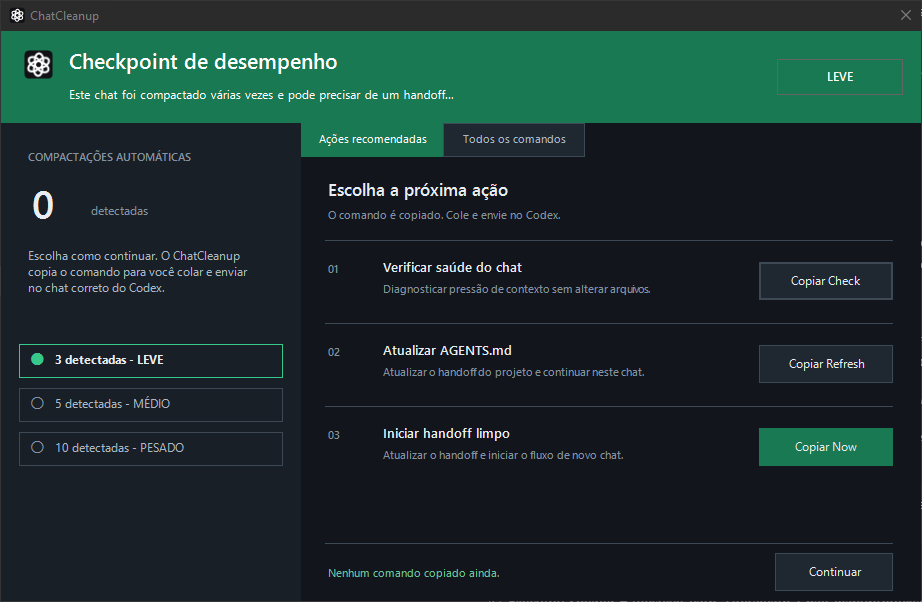

# ChatCleanup

> Handoff limpo, comandos globais e uma janela nativa para continuar o trabalho no Codex.



[](https://github.com/maneco2/ProjectCleanup)


ChatCleanup é um plugin local e global para organizar chats longos do Codex.
Ele mantém o handoff do projeto no `AGENTS.md`, oferece comandos simples no
chat e pode exibir um checkpoint nativo no Windows quando a compactação
automática atinge um marco importante.

O projeto é deliberadamente pequeno: não há MCP, servidor local, Home embutido,
serviço remoto ou dependência externa de runtime.

## Visão rápida

```text
chat longo
    │
    ├── check / preview / status  →  consultar sem escrever
    │
    ├── refresh                   →  atualizar o handoff atual
    │
    └── now                       →  preparar o /init e continuar limpo
```

## Comandos globais

Instale o plugin uma vez e use os mesmos comandos em qualquer projeto ativo:

| Comando | O que faz | Escreve arquivos? |
| --- | --- | :---: |
| `/chat-cleanup` | Abre o fluxo guiado e a janela local de comandos quando disponível. | Não |
| `/chat-cleanup check` | Classifica a pressão e a saúde do chat atual. | Não |
| `/chat-cleanup preview` | Monta um handoff proposto apenas na conversa. | Não |
| `/chat-cleanup status` | Verifica presença, tamanho, marcadores e frescor do `AGENTS.md`. | Não |
| `/chat-cleanup refresh` | Atualiza diretamente o bloco gerenciado do `AGENTS.md` ativo. | Sim |
| `/chat-cleanup now` | Atualiza o handoff, prepara o `/init` e inicia o próximo chat quando o host oferece essa capacidade. | Pode |

Fluxo recomendado:

```text
/chat-cleanup check
/chat-cleanup preview
/chat-cleanup refresh
/chat-cleanup now
```

Os botões da janela apenas copiam os comandos. Você cola e envia no chat
correto; o plugin não injeta teclado, não envia mensagens automaticamente e
não abre uma segunda interface dentro do Codex.

## Checkpoint nativo no Windows

Depois de uma compactação automática, o hook pode abrir a janela
`ChatCleanup — Performance Checkpoint`. Ela mostra:

- o contador atual da sessão;
- os níveis `LIGHT`, `MEDIUM` e `HEAVY`;
- a progressão de 3, 5 e 10 compactações;
- ações recomendadas para o momento;
- todos os comandos globais em uma aba separada;
- botões de cópia para cada comando;
- ícone visual do Codex, sem o ícone padrão do PowerShell.

| Marco | Nível | Próxima ação sugerida |
| ---: | --- | --- |
| 0–2 | `LIGHT` | Continuar normalmente. |
| 3–4 | `LIGHT` | Considerar `/chat-cleanup refresh`. |
| 5–9 | `MEDIUM` | Atualizar o handoff antes de continuar muito. |
| 10+ | `HEAVY` | Usar `/chat-cleanup now`. |

Se a janela não puder ser aberta, o hook continua silenciosamente ou mostra
uma mensagem curta de fallback no chat. Um checkpoint nunca interrompe o
trabalho principal.

## Handoff seguro

O comando `refresh` preserva tudo fora do bloco gerenciado da raiz ativa:

```html
<!-- BEGIN PROJECTCLEANUP HANDOFF -->
<!-- handoff atual do projeto -->
<!-- END PROJECTCLEANUP HANDOFF -->
```

O conteúdo atualizado registra apenas informações operacionais do projeto:
escopo, estado, decisões, arquivos relevantes, validações, próximos passos e
riscos. Segredos, tokens, cookies, chaves privadas, credenciais e transcrições
de chat ficam fora do handoff.

## Idiomas

A janela nativa possui catálogos locais para:

| Idioma | Código | Observação |
| --- | --- | --- |
| English | `en` | Inglês |
| Português (Brasil) | `pt-BR` | Português brasileiro |
| Español | `es` | Espanhol |
| Français | `fr` | Francês |
| Deutsch | `de` | Alemão |
| Italiano | `it` | Italiano |
| Chinês simplificado | `zh-Hans` | Escrita simplificada |
| Chinês tradicional | `zh-Hant` | Escrita tradicional |
| 日本語 | `ja` | Japonês |
| 한국어 | `ko` | Coreano |
| Русский | `ru` | Russo |
| العربية | `ar` | Layout nativo da direita para a esquerda |

Os comandos slash permanecem globais e iguais em todos os idiomas. Apenas a
interface, descrições, níveis e mensagens da janela são traduzidos.

## Instalação e desenvolvimento

O pacote distribuível é a pasta `ChatCleanup/` deste repositório. Depois de
editar o plugin localmente, valide o pacote e atualize o cachebuster do
manifesto:

```powershell
python C:\Users\manec\.codex\skills\.system\plugin-creator\scripts\validate_plugin.py ChatCleanup
python C:\Users\manec\.codex\skills\.system\plugin-creator\scripts\update_plugin_cachebuster.py ChatCleanup
```

Depois, reinstale o plugin pelo marketplace local e abra um novo chat para
carregar as skills atualizadas.

Validações úteis:

```powershell
python ChatCleanup\references\chat-cleanup-shared\scripts\validate_agent_md.py AGENTS.md --strict-size
```

## Estrutura

```text
.
├── AGENTS.md
├── LICENSE
├── README.md
└── ChatCleanup
    ├── assets
    │   └── chatcleanup-checkpoint.png
    ├── .codex-plugin/plugin.json
    ├── hooks
    │   ├── hooks.json
    │   ├── post_compact.ps1
    │   ├── post_compact.py
    │   └── show_checkpoint.ps1
    ├── references/chat-cleanup-shared
    │   ├── WORKFLOW.md
    │   ├── agents/openai.yaml
    │   ├── references/agent-template.md
    │   └── scripts/validate_agent_md.py
    └── skills
        ├── chat-cleanup-guided
        ├── chat-cleanup-check
        ├── chat-cleanup-preview
        ├── chat-cleanup-status
        ├── chat-cleanup-now
        └── chat-cleanup-refresh
```

## Princípios

- comandos globais, simples e copiáveis;
- contexto limitado ao projeto e ao chat atuais;
- escrita somente no bloco gerenciado do `AGENTS.md`;
- janela nativa opcional e somente para orientação;
- fallback seguro quando o ambiente gráfico não está disponível;
- nenhuma automação de teclado, mouse ou envio oculto;
- nenhuma publicação, alteração de marketplace ou commit automático.

## Licença

MIT. Consulte [LICENSE](LICENSE).

## Autor

Criado por **Odair Devalier — L2JServer Junior Developer**.
